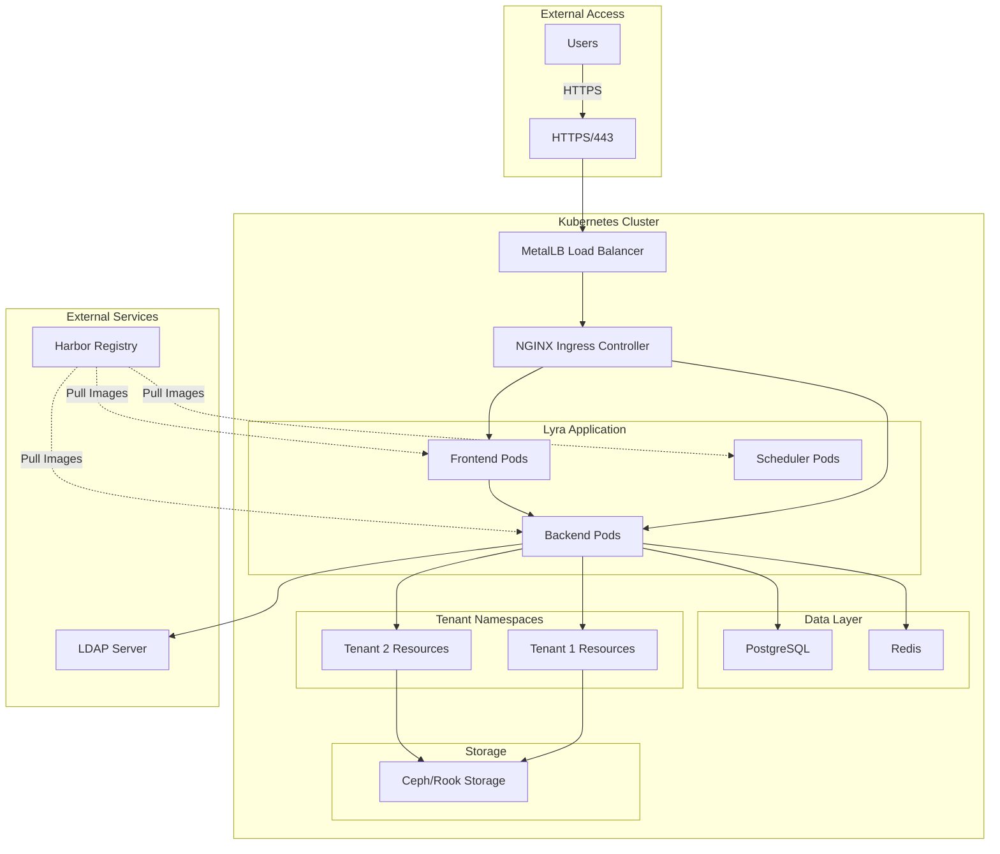

# Installation Guide

Welcome to the Lyra Platform installation guide. This comprehensive guide will walk you through deploying Lyra on your Kubernetes cluster.

## Overview

The Lyra installation process consists of several major steps:

1. **Prerequisites** - Prepare your environment and gather requirements
2. **Kubernetes Setup** - Configure your Kubernetes cluster
3. **Storage Setup** - Deploy Ceph storage with Rook
4. **Networking** - Configure MetalLB for load balancing
5. **Ingress Controller** - Set up NGINX Ingress Controller
6. **Harbor Registry** - Deploy container registry
7. **Rancher** - Install Kubernetes management platform
8. **PostgreSQL** - Deploy database server
9. **Redis** - Set up caching layer
10. **Lyra Application** - Deploy the main application
11. **Post-Installation** - Verify and configure your installation

## Installation Paths

Choose the installation path that best fits your needs:

=== "Quick Start"

    **Best for**: Testing and evaluation

    **Time**: ~2 hours

    **Components**:

    - Minimal Kubernetes cluster (3 nodes)
    - Basic storage configuration
    - Lyra application with default settings

    [:octicons-arrow-right-24: Quick start guide](quick-start.md)

=== "Production"

    **Best for**: Production deployments

    **Time**: 1-2 days

    **Components**:

    - High-availability Kubernetes cluster (5+ nodes)
    - Ceph storage cluster with redundancy
    - SSL certificates and security hardening
    - Monitoring and backup configuration
    - Full LDAP integration

    [:octicons-arrow-right-24: Production guide](prerequisites.md)

=== "Development"

    **Best for**: Development and testing

    **Time**: ~1 hour

    **Components**:

    - Local Kubernetes (k3s/minikube)
    - Single-node setup
    - Development tools and utilities

    [:octicons-arrow-right-24: Development guide](development.md)

## Architecture Diagram

## System Requirements

### Minimum Requirements

| Component | Requirement |
|-----------|-------------|
| **Kubernetes Version** | 1.24 or higher |
| **Worker Nodes** | 3 nodes minimum |
| **CPU per Node** | 8 cores |
| **Memory per Node** | 16 GB RAM |
| **Storage** | 100 GB available |
| **Network** | 1 Gbps |

### Recommended Requirements

| Component | Requirement |
|-----------|-------------|
| **Kubernetes Version** | 1.27 or higher |
| **Worker Nodes** | 5+ nodes |
| **CPU per Node** | 16 cores |
| **Memory per Node** | 32 GB RAM |
| **Storage** | 500 GB+ (Ceph cluster) |
| **Network** | 10 Gbps |

!!! warning "Production Deployments"
    For production deployments, we strongly recommend following the recommended requirements to ensure optimal performance and reliability.

## Pre-Installation Checklist

Before starting the installation, ensure you have:

- [ ] Kubernetes cluster access with cluster-admin privileges
- [ ] `kubectl` configured and working
- [ ] Helm 3.x installed
- [ ] Sufficient hardware resources
- [ ] Network access to download container images
- [ ] SSL certificates (for production)
- [ ] LDAP server details (if using LDAP integration)
- [ ] PostgreSQL database (or plan to deploy one)
- [ ] Redis instance (or plan to deploy one)

## Next Steps

1. **Review Prerequisites**: Start with the [prerequisites page](prerequisites.md) to ensure your environment is ready
2. **Choose Installation Method**: Decide between quick start, production, or development installation
3. **Follow the Guide**: Work through each section in order
4. **Verify Installation**: Complete the post-installation verification steps

## Getting Help

If you encounter issues during installation:

- Check the [troubleshooting guide](../troubleshooting/index.md)
- Review the [common issues](../troubleshooting/common-issues.md) page
- Consult the [FAQ](../troubleshooting/faq.md)

## Estimated Installation Time

| Installation Type | Time Required | Difficulty |
|-------------------|---------------|------------|
| **Quick Start** | ~2 hours | Easy |
| **Development** | ~1 hour | Easy |
| **Production** | 1-2 days | Moderate to Advanced |

!!! tip "Time-Saving Tips"
    - Have all prerequisites ready before starting
    - Use automation scripts where available
    - Deploy infrastructure components in parallel when possible
    - Review the entire guide before beginning

## Support

For additional support:

- **Documentation**: Browse the complete [documentation](../index.md)
- **API Reference**: See the [API documentation](../api/index.md)
- **Community**: Join our community forums
- **Enterprise Support**: Contact sales for enterprise support options

---

Ready to begin? Start with the [prerequisites page](prerequisites.md) to prepare your environment.
